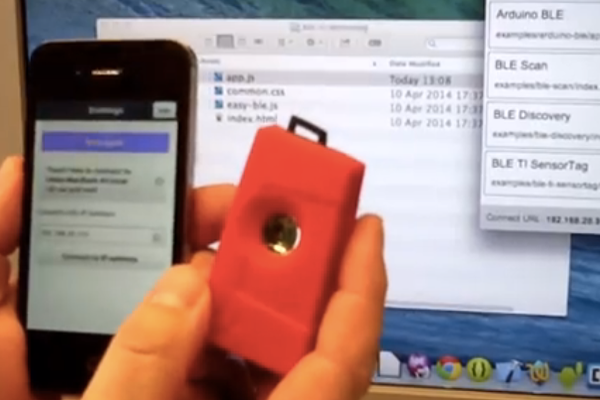
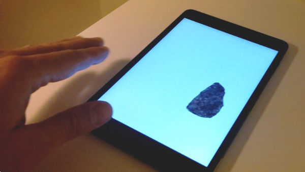

# Magic Stone - Make mobile apps for the TI SensorTag in JavaScript

Mikael Kindborg, Evothings AB

## TI SensorTag

The [Texas Instruments TI SensorTag](http://www.ti.com/ww/en/wireless_connectivity/sensortag/) is a small device that features a range of sensors that can be used for various projects and applications.

Here is a photo of the TI SensorTag:

## Magic Stone demo app

Magic Stone is a demo app that showcases the TI SensorTag. Coded in JavaScript, the app runs on a mobile phone or tablet (Android or iOS), reading accelerometer input from the TI SensorTag to control an onscreen object - a scanned image of a stone I found in my garden.

This is what the app looks like:

[Watch a video of the app in action](http://www.youtube.com/watch?v=Cxd0OS1FNsc) - revealing the hidden TI SensorTag :)

The idea for this app started with a hack done at an Evothings hackathon, on March 26, 2014. [Watch this video from the event](http://www.youtube.com/watch?v=lO9Ys4uOjdY) :)

## Running the app using Evothings Studio

The Magic Stone app has been developed using [**Evothings Studio**](http://evothings.com/download).

To run the app, do as follows:

* [Download Evothings Studio](http://evothings.com/download)
* Install the **Evothings Client** app on your iOS or Android device (available in the AppStore and on Google Play)
* Grab the [source code for the Magic Stone app](https://github.com/divineprog/evo-demos/tree/master/Demos2014/MagicStone) from GitHub
* Drag and drop index.html into the Evothings Workbench running on your computer
* Connect from Evothings Client to the Workbench
* Press Run in the Workbench
* Make sure the SensorTag is in announce mode
* Use the SensorTag to control the movements of the stone (the accelerometer is used for this)

## Using BLE from JavaScript

The TI SensorTag uses Bluetooth Low Energy (BLE) to communicate with your phone or tablet. To access BLE from JavaScript, the [Evothings BLE plugin for Apache Cordova](https://github.com/evothings/cordova-ble) is used.

Files of interest:

* [ble.js](https://github.com/evothings/cordova-ble/blob/master/ble.js) is the API for the BLE plugin. This file is shipped with the Evothings Client app (which is built with Cordova), and is not included in the source code for the Magic Stone app.
* [easy-ble.js](https://github.com/divineprog/evo-demos/blob/master/Demos2014/MagicStone/easy-ble.js) is a high-level abstraction of the API in ble.js.
* [sensortag.js](https://github.com/divineprog/evo-demos/blob/master/Demos2014/MagicStone/sensortag.js) is a high-level library for the TI SensorTag. The only sensor implemented at the moment is the accelerometer. It is easy to add more sensors, and this is something I am planning to do.

The documentation for the UUIDs used by SensorTag services and characteristics is found here: [SensorTag_User_Guide](http://processors.wiki.ti.com/index.php/SensorTag_User_Guide),
[BLE_SensorTag_GATT_Server.pdf](http://processors.wiki.ti.com/index.php/File:BLE_SensorTag_GATT_Server.pdf).

## Building a native app

Any app you create using Evothings Studio can be packaged as a native Apache Cordova app, that can then be published on the app stores. Actually, the Evothings Client app itself is a Cordova app, and it was even developed using Evothings Workbench!

Building a native app with Apache Cordova:

* Install the mobile development kit(s) you want to build for (e.g.
Android, iOS, Windows Phone)
* For iOS you need a Mac with Xcode and an Apple developer
 membership to install apps on devices.
* For Android you need the Android SDK.
* Install Apache Cordova and create a template app by following the
[instructions in the Cordova tutorial](http://cordova.apache.org/docs/en/3.4.0/guide_cli_index.md.html#The%20Command-Line%20Interface)
* The above step can take some time and effort to complete!
* Put your HTML, CSS, JavaScript and media files in the www folder in
the Cordova project.
* Build and test your app. The output depends on the platform. For
iOS you get an Xcode project you can open and run, for Android you get
and apk-file you can install on your device.
* Note that it works perfectly fine to develop the Cordova app in
Evothings Studio. Just drag and drop index.html in project list in the
Workbench window. Then run the app using Evothings Client, or...
* ...enter the connect url in place of index.html in config.xml. When you
start the app it will connect to the Workbench, just click Run in the Workbench to
launch your app.
* You can now build your app and deploy it to the app stores.

## Share your projects

Feel free to announce your apps on the [Evothings Forum](http://forum.evothings.com/). We would love to hear about your work!
